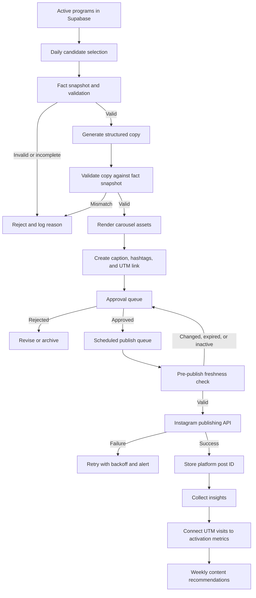

# Automated Instagram Marketing Plan

## 1. Purpose

Build a reliable content system that turns active government-support program data in eunwon into one useful Instagram post per day, while protecting accuracy and brand trust.

The system should automate repetitive production work without automatically publishing unverified claims. The recommended initial operating model is **automated generation, human approval, automated publishing**.

### Campaign objective

Within the first 30 days:

- Publish 5–7 useful posts per week.
- Establish eunwon as a trustworthy interpreter of government-support programs.
- Drive qualified visitors to the free business-profile matching flow.
- Learn which audiences and content formats generate saves, profile completions, and signups.

### Primary audience

Founders and operators of Korean businesses that are 1–7 years old and struggle to determine:

- which programs apply to their company;
- whether they meet location, business-age, and entity requirements;
- which deadlines deserve attention;
- what they should do after finding a relevant announcement.

### Core message

> 우리 회사가 받을 수 있었던 지원금, 놓치고 있지는 않나요?
>
> 사업 정보를 입력하면 은원 AI가 맞는 지원사업과 신청 이유를 정리해드립니다.

The product should be positioned as the personalized action layer above public announcement portals—not simply as another list of programs.

---

## 2. Operating Principles

1. **Official facts come from structured source data.** AI may rewrite facts, but must not invent amounts, dates, eligibility, or agencies.
2. **Every program post links to the original announcement.** The source agency and retrieval time should be stored with the draft.
3. **A match is not a guarantee.** Use language such as `확인 대상`, `예상 매칭`, or `신청 가능성을 확인하세요`.
4. **Human approval remains mandatory for the initial 30–50 posts.** Full auto-publishing is considered only after accuracy and reliability are measured.
5. **Templates, not generated text-in-image art, render the carousels.** This ensures correct Korean typography, predictable layouts, and brand consistency.
6. **The account teaches more often than it sells.** At most 15–20% of posts should be direct product promotion.
7. **Every post has one measurable CTA.** Initially: complete the free eunwon business-profile diagnostic.

---

## 3. Recommended Platform Stack

### Recommended v1: native eunwon stack

| Responsibility | Recommended platform | Why |
|---|---|---|
| Source data | Supabase Postgres | Programs and profiles already live here; one auditable source of truth |
| Draft and approval state | Supabase Postgres | Simple relational workflow, history, RLS, and no additional SaaS |
| Asset storage | Supabase Storage | Keeps carousel files beside the existing application data |
| Content selection and generation | Next.js server routes on Vercel | Reuses the codebase, Upstage client, validation, and deployment pipeline |
| Scheduling | Vercel Cron | Already used by eunwon; suitable for daily generation and publishing triggers |
| Image rendering | React/HTML templates rendered to PNG | Precise Korean typography and direct use of the project design system |
| Publishing | Meta Instagram Platform API | Direct integration, fewer moving parts, and control over publishing state |
| Admin approval | `/admin/marketing` in eunwon | Preview, edit, approve, reject, reschedule, and retry in one place |
| Analytics | Meta insights + eunwon UTM events | Connects post performance to profile completions and signups |
| Error notifications | Resend email initially | Already present in the stack; Slack can be added later |

Vercel Cron invokes application routes on a schedule, but it does not automatically retry failed jobs. Jobs must therefore be idempotent and store each attempt. See [Vercel Cron Jobs](https://vercel.com/docs/cron-jobs) and [Managing Cron Jobs](https://vercel.com/docs/cron-jobs/manage-cron-jobs).

### Why this is the best starting point

- It minimizes new accounts, subscriptions, secrets, and failure points.
- Business facts stay in the application instead of moving through several automation vendors.
- The approval interface can show the exact underlying program beside the generated post.
- The rendering layer can follow `DESIGN.md` precisely.
- It remains easy to replace individual pieces later.

### Optional platform alternatives

| Platform | Best use | Benefits | Trade-offs | Recommendation |
|---|---|---|---|---|
| **n8n Cloud / self-hosted n8n** | Visual orchestration across many channels | Easy branching, webhooks, notifications, and non-developer visibility | Another runtime and credential store; core validation still belongs in eunwon | Add when operating 3+ channels or when a marketer needs to own workflows |
| **Make** | Fast no-code prototype | Quick integrations and visual scenarios | Usage-based costs and weaker source-controlled logic | Useful for a short prototype, not the system of record |
| **Zapier** | Simple triggers and notifications | Very accessible and broad integrations | Expensive for multi-step media workflows; limited rendering control | Use for alerts only if already subscribed |
| **Buffer / Later** | Editorial calendar and manual scheduling | Strong calendar UX and team approvals | Adds a second content database; API capabilities and plan limits can change | Consider when a marketing team needs multi-network collaboration |
| **Cloudinary** | Hosted asset transformation and delivery | Mature image storage, optimization, text/image overlays, and a Next.js SDK | Complex carousel layouts may be harder than HTML/CSS; extra vendor | Good upgrade when media volume grows; see [Cloudinary image transformations](https://cloudinary.com/documentation/javascript_image_transformations) |
| **Bannerbear / Placid** | Template-based social images | Fastest way to launch editable branded templates | Per-image cost and vendor lock-in | Good if speed matters more than owning the renderer |
| **Canva** | Human-designed master templates | Familiar design collaboration | Less suitable as the core deterministic rendering engine | Use to explore concepts, then reproduce approved templates in code |

### Platform recommendation by stage

#### Stage 1: first 30–50 posts

Use **Supabase + Vercel + a native approval page + direct Meta publishing**. Render templates in code and require approval.

#### Stage 2: multiple channels

Keep eunwon as the source of truth, then add **n8n** for distribution to Instagram, LinkedIn, email, and internal notifications. n8n should call eunwon APIs rather than own business rules.

#### Stage 3: higher media volume

Add **Cloudinary** for transformations and delivery, or a dedicated rendering provider if the editorial team must edit layouts without code.

---

## 4. End-to-End Automated Flow



### Step 1: daily candidate selection

A daily job selects 3–5 candidates and ranks them. Selection should be deterministic and explainable.

Suggested score:

```text
candidate_score =
  audience_relevance * 0.30
  + deadline_urgency * 0.25
  + benefit_clarity * 0.20
  + source_completeness * 0.15
  + content_novelty * 0.10
```

Exclusion rules:

- inactive or expired programs;
- missing original source URL;
- missing deadline when the post requires a deadline;
- missing or ambiguous eligibility fields;
- programs posted recently;
- unresolved duplicate or stale-source warnings.

At least one day per week should be reserved for a reactive or manually selected post rather than a program recommendation.

### Step 2: freeze a fact snapshot

Store a JSON snapshot of the program fields used to create the post. This makes later audits possible even if the underlying program changes.

Required facts:

- program title;
- source agency;
- source URL;
- eligible regions;
- entity and business-age constraints;
- benefit or amount text;
- deadline;
- application URL;
- source update/retrieval time.

### Step 3: generate structured content

Ask the language model for JSON—not a finished graphic. Suggested contract:

```json
{
  "contentType": "program_spotlight",
  "audience": "서울 소재 창업 3년 이내 기업",
  "hook": "서울 초기 스타트업이라면 확인하세요",
  "slides": [
    { "type": "hook", "headline": "...", "body": "..." },
    { "type": "eligibility", "headline": "지원 대상", "bullets": ["..."] },
    { "type": "benefit", "headline": "지원 내용", "body": "..." },
    { "type": "deadline", "headline": "신청 마감", "body": "..." },
    { "type": "cta", "headline": "우리 회사도 해당될까요?", "body": "..." }
  ],
  "caption": "...",
  "disclaimer": "최종 신청 자격은 공식 공고를 확인해주세요.",
  "sourceLabel": "...",
  "hashtags": ["정부지원사업", "스타트업지원금"]
}
```

Generation rules:

- Each factual claim should map to one field in the fact snapshot.
- Do not infer an exact amount from vague amount text.
- Do not state that a company will receive funding.
- Use plain Korean and define administrative terminology.
- Keep slide text short enough for mobile reading.
- Output no unsupported ranking such as `최고`, `가장 좋은`, or `무조건`.

### Step 4: validate generated copy

Use two validation layers:

1. **Code validation:** schema, length, date format, required fields, prohibited phrases, and exact comparison of amounts and deadlines.
2. **AI-assisted review:** compare the draft with the fact snapshot and return unsupported claims. This review can flag content but must not silently rewrite official facts.

Any high-risk mismatch changes the draft status to `validation_failed` and blocks rendering or publishing.

### Step 5: render the carousel

Render each slide at Instagram portrait dimensions (`1080 × 1350`) using reusable React/HTML templates.

Initial template set:

- program spotlight;
- deadline roundup;
- eligibility explainer;
- common mistake;
- eunwon product walkthrough;
- anonymized customer result.

Rendering requirements:

- follow `DESIGN.md` tokens and eunwon adaptation notes;
- DM Sans only;
- sufficient contrast and safe margins;
- maximum text density per template;
- source label on factual slides;
- slide number and eunwon handle;
- CTA only on the final slide;
- alt text stored with every image.

Upload rendered assets to a private staging path, then move or copy them to a publicly retrievable publishing path only when needed by the platform API.

### Step 6: approval workflow

The `/admin/marketing` page should provide:

- carousel preview at mobile size;
- underlying source facts beside generated claims;
- caption and hashtag editor;
- source link opener;
- approve, reject, regenerate, and schedule actions;
- audit history showing who changed what;
- warning if the post is too similar to a recent post.

Suggested states:

```text
candidate
→ generating
→ validation_failed | awaiting_approval
→ rejected | approved
→ scheduled
→ publishing
→ published | publish_failed | cancelled
```

Only an admin or marketing-editor role may approve or publish.

### Step 7: schedule and publish

Run a small publishing worker periodically rather than creating one cron entry per post.

Publishing sequence:

1. Lock the scheduled post so two workers cannot publish it.
2. Confirm that it has not already been published.
3. Re-read the program and compare it with the fact snapshot.
4. Return the post to approval if the deadline, status, amount, or eligibility changed.
5. Create the media container(s) through Meta.
6. Wait for media processing when required.
7. Publish the container.
8. Store the Instagram media ID, permalink, timestamp, and exact caption.
9. Release the lock and record the attempt.

Use an idempotency key such as:

```text
instagram:{instagram_account_id}:{marketing_post_id}
```

### Step 8: retry and alert

Vercel does not retry failed cron invocations automatically, so retry state belongs in the database.

Recommended policy:

- transient API or network error: retry after 5, 20, and 60 minutes;
- authorization error: stop retries and alert immediately;
- invalid media or caption: return to approval;
- expired or inactive program: cancel publication;
- unknown error after three attempts: set `publish_failed` and notify an admin.

Never generate a new duplicate post as part of a retry.

### Step 9: collect performance data

Collect post insights on a delayed schedule because metrics are not immediately complete.

Suggested collection windows:

- 24 hours;
- 72 hours;
- 7 days;
- 30 days.

Store:

- reach and impressions when available;
- likes, comments, shares, and saves;
- profile visits and follows when available;
- carousel content type and template;
- outbound UTM visits;
- diagnostic starts;
- completed business profiles;
- signups and paid conversions.

The primary metric should be **activated users per post**, not follower count.

---

## 5. Suggested Data Model

### `marketing_posts`

```sql
id                    uuid primary key
program_id            uuid null references programs(id)
content_type          text not null
status                text not null
fact_snapshot         jsonb not null
generated_content     jsonb
caption               text
alt_texts             text[]
source_url            text
scheduled_for         timestamptz
approved_at           timestamptz
approved_by           uuid null
platform              text default 'instagram'
platform_media_id     text
platform_permalink    text
idempotency_key       text unique
generation_version    text
template_version      text
created_at            timestamptz default now()
updated_at            timestamptz default now()
```

### `marketing_assets`

```sql
id                    uuid primary key
marketing_post_id     uuid references marketing_posts(id)
slide_index           int not null
storage_path          text not null
width                 int not null
height                int not null
checksum              text not null
created_at            timestamptz default now()
unique(marketing_post_id, slide_index)
```

### `marketing_publish_attempts`

```sql
id                    uuid primary key
marketing_post_id     uuid references marketing_posts(id)
attempt_number        int not null
started_at            timestamptz not null
finished_at           timestamptz
result                text
platform_error_code   text
error_summary         text
retry_after           timestamptz
```

### `marketing_insights`

```sql
id                    uuid primary key
marketing_post_id     uuid references marketing_posts(id)
measurement_window    text not null
measured_at           timestamptz not null
metrics               jsonb not null
unique(marketing_post_id, measurement_window)
```

Use RLS to prevent normal users from reading unpublished content, tokens, operational errors, or approval history.

---

## 6. Job Schedule

All Vercel cron expressions use UTC. Convert intended Korea Standard Time schedules before committing them.

| Job | Suggested KST time | Purpose |
|---|---:|---|
| Candidate generation | 18:00 daily | Prepare tomorrow's draft |
| Approval reminder | 09:00 daily | Notify admin about pending drafts |
| Publish worker | Every 10–15 minutes | Publish approved posts due now |
| Insight collection | Hourly or daily | Collect due 24h/72h/7d/30d snapshots |
| Weekly report | Monday 09:00 | Recommend topics and templates for the week |
| Cleanup | Weekly | Remove abandoned temporary assets and old locks |

If the Vercel plan does not support the desired frequency or timing precision, use Supabase Cron. Supabase can schedule SQL, database functions, HTTP calls, or Edge Functions and records job history. See [Supabase Cron](https://supabase.com/docs/guides/cron).

Supabase Queues can be introduced when generation, rendering, and publishing need durable independent workers. It provides a Postgres-backed pull queue; see [Supabase Queues](https://supabase.com/docs/guides/queues/quickstart).

---

## 7. Week 1 Editorial Plan

| Day | Content | Funnel stage | CTA |
|---|---|---|---|
| 1 | 정부지원사업, 제목만 보고 넘기면 안 되는 이유 | Awareness | Save the checklist |
| 2 | Current program spotlight for early startups | Consideration | Check company fit |
| 3 | 업력 3년·7년이 중요한 이유 | Awareness | Share with a founder |
| 4 | Current program spotlight for small businesses | Consideration | Run free matching |
| 5 | 지원 대상에서 자주 탈락하는 조건 5가지 | Consideration | Save for later |
| 6 | eunwon matching walkthrough | Conversion | Complete a profile |
| 7 | 이번 주 마감 임박 지원사업 roundup | Conversion | View current matches |

Recommended monthly content mix:

- 50% current program recommendations;
- 25% educational explainers;
- 15% product walkthroughs or proof;
- 10% founder stories, questions, or results.

Leave at least 20% of the schedule flexible for new announcements and observed audience questions.

---

## 8. Measurement Plan

### Content metrics

- save rate;
- share rate;
- profile-visit rate;
- follows per reached account;
- completion rate by carousel slide if available;
- comments containing a genuine eligibility question.

### Product metrics

- Instagram UTM visitor → diagnostic start;
- diagnostic start → profile completion;
- profile completion → first match viewed or saved;
- activated user → paid conversion;
- cost per activated user if paid promotion is added.

### Initial decision rules

- Continue a template if it produces above-median saves or activated users across at least three posts.
- Rewrite a hook style if reach is reasonable but saves and profile visits are weak.
- Retire a topic after three consistently weak posts.
- Do not boost a post with paid media until it has demonstrated organic saves, shares, or conversions.
- Review qualitative comments weekly; repeated questions become new explainer posts.

---

## 9. Security and Compliance

- Store Meta access tokens only in server-side encrypted environment variables or a dedicated secrets manager.
- Request the minimum Meta permissions required for the connected account.
- Never expose the Supabase service-role key or publishing token to the browser.
- Protect all cron routes with `CRON_SECRET` and validate it server-side.
- Keep approval and publishing APIs behind admin authorization.
- Record an immutable audit event for approvals, edits, and publications.
- Do not publish personal company-profile data without explicit consent.
- Obtain written permission before publishing a customer story or screenshot.
- Include a clear source and eligibility disclaimer on factual content.
- Create a token-expiry and authorization-failure alert before launch.

---

## 10. Implementation Phases

### Phase 0: account and API setup

- Create the eunwon Instagram Professional account.
- Configure the corresponding Meta developer application and required publishing access.
- Add a test Instagram account for development.
- Establish the bio, profile image, link destination, and UTM convention.
- Confirm publishing permissions and token renewal requirements in Meta's current documentation before implementation.

### Phase 1: draft generator

- Add the marketing tables and RLS policies.
- Implement candidate selection and exclusion rules.
- Store fact snapshots.
- Generate schema-constrained content.
- Implement deterministic validation.
- Generate drafts manually from an admin-only endpoint.

**Exit criterion:** ten representative programs produce accurate structured drafts with no unsupported facts.

### Phase 2: carousel renderer

- Design the first three templates according to `DESIGN.md`.
- Render `1080 × 1350` PNG assets.
- Test long Korean titles, missing optional fields, and large amounts.
- Add alt text and source labels.
- Store checksums and template versions.

**Exit criterion:** all test cases render without clipping, overflow, or unreadable text.

### Phase 3: approval dashboard

- Add preview and source comparison.
- Add editing, rejection, regeneration, and scheduling.
- Add role checks and audit history.
- Add mobile preview and warning states.

**Exit criterion:** a reviewer can approve or reject a complete post without accessing Supabase directly.

### Phase 4: publishing integration

- Connect the Instagram publishing API.
- Add pre-publish freshness validation.
- Add locks, idempotency, attempts, retry state, and alerts.
- Test with a non-production account.
- Run one week with approval required for every post.

**Exit criterion:** seven scheduled test posts publish once each, with failures recoverable from the admin interface.

### Phase 5: analytics and optimization

- Add insight snapshots.
- Add UTM attribution to product analytics.
- Build a weekly report by topic, audience, hook, and template.
- Use performance data to recommend—not autonomously enact—the following week's content mix.

**Exit criterion:** each published post can be connected to reach, engagement, site sessions, and activated users.

### Phase 6: controlled expansion

- Add LinkedIn or email repurposing.
- Introduce n8n only if visual cross-channel orchestration is valuable.
- Introduce a durable queue if job volume or execution time requires it.
- Consider relaxing approval only for low-risk evergreen explainers with proven templates.

---

## 11. Launch Checklist

### Content and brand

- [ ] Instagram handle and bio approved
- [ ] Profile image and link destination ready
- [ ] Three carousel templates approved
- [ ] Korean text overflow tests pass
- [ ] Source label and disclaimer included
- [ ] First seven posts reviewed

### Product and infrastructure

- [ ] Marketing migrations applied
- [ ] RLS and admin roles verified
- [ ] Cron routes secured
- [ ] Fact validation blocks unsupported claims
- [ ] Rendering is deterministic and versioned
- [ ] Duplicate-publication protection tested
- [ ] Retry and failure alerts tested
- [ ] Token expiration alert configured

### Measurement

- [ ] UTM naming convention documented
- [ ] Instagram traffic appears in analytics
- [ ] Diagnostic start and profile completion events tracked
- [ ] Weekly report owner assigned
- [ ] 30-day review date scheduled

---

## 12. Decisions to Revisit as the System Grows

- Whether Vercel Cron remains sufficient or publishing should move to Supabase Cron/Queues.
- Whether asset rendering should remain native or move to Cloudinary/Bannerbear.
- Whether a third-party scheduler provides enough team collaboration value.
- Whether low-risk evergreen posts can bypass manual approval.
- Whether performance data is sufficient to personalize content by segment or region.
- Whether additional program sources are complete enough to support broader marketing claims.

The recommended first investment is accuracy, approval UX, and attribution—not maximum automation. A daily post that users trust and act on is more valuable than a larger volume of generic content.
